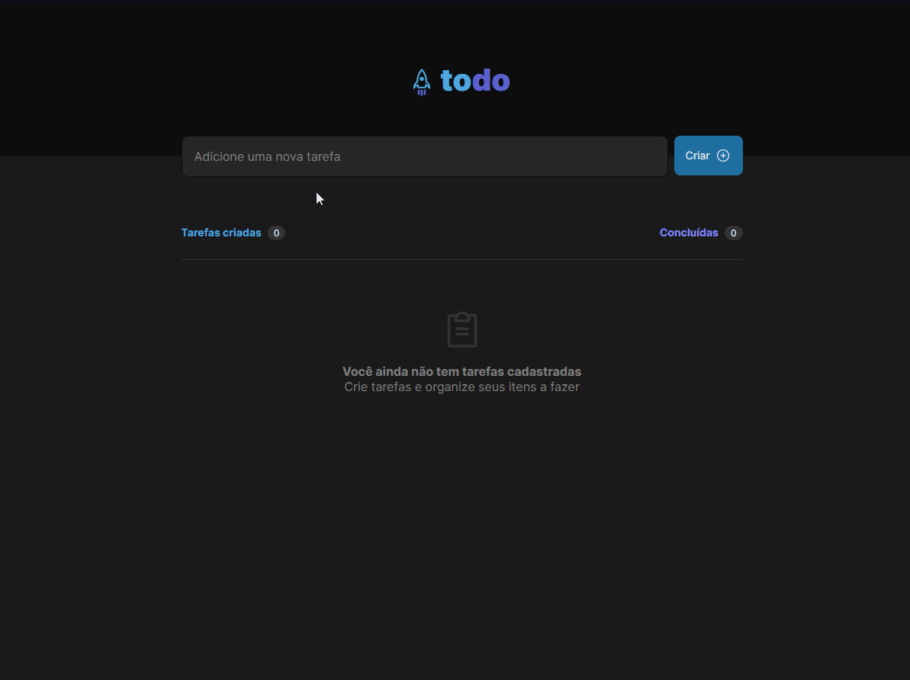
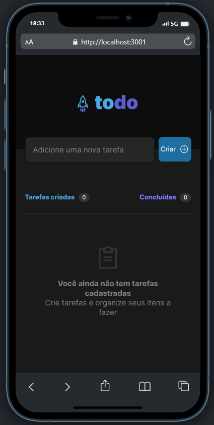
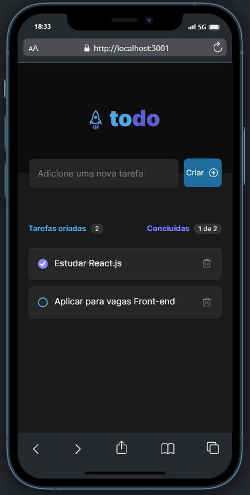

<h1 align="center"> Projeto To-do List 📝 </h1>

Este projeto é uma lista de tarefas, utilizando o conceito de SPA, e aplicando funcionalidades como adicionar uma tarefa, remover, listar a quantidade de tarefas criadas e concluídas.

  

---

# Link :paperclip:

  * [todo-list.vercel.app](https://todo-list-gules-theta.vercel.app)

---

## Tecnologias usadas :computer:

  * React.js
  * Typescript
  * HTML
  * CSS
  * Vite
---

### Como instalar as dependências

1. Clone o repositório
  * `git clone git@github.com:Vanim77/todo-list.git`.
  * Entre na pasta do repositório que você acabou de clonar:
    * `cd todo-list`

1. Instale as dependências
   * `npm install`

---

### Iniciando a aplicação no terminal :desktop_computer: :computer_mouse:

Na pasta da aplicação, execute o comando `npm start`.

Abra o navegador na URL `localhost:3001`

Navegue dentro da aplicação! 🌟

---

### Versão mobile 📱

  
  

